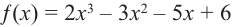

# PolynomialSolution

Пример решения многочлена:

Корни многочлена: 1.0, 2.0, -1.5

Время работы алгоритма: 475 milliseconds

Пример решения данного многочлена руками: https://natalibrilenova.ru/nahozhdenie-ratsionalnyih-kornej/

Решение произвольного многочлена с коэффициентами:
Array(3445, -2497, -2509, 2134, -92510457)

Корни многочлена: 13.0

Время работы алгоритма: 580 milliseconds